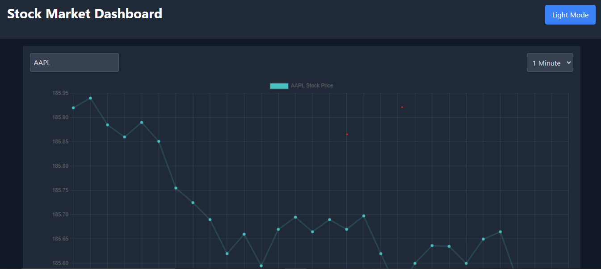
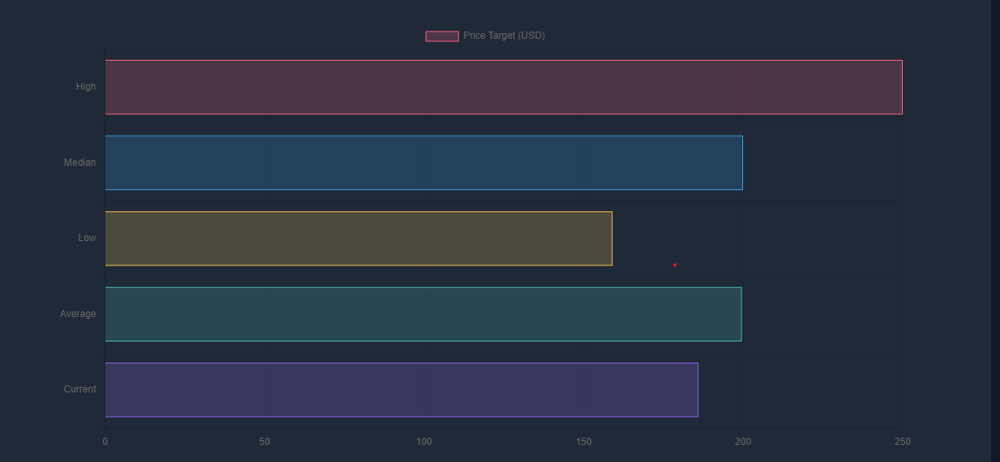

## Stock Analysis Dashboard

### Introduction

Stock Analysis Dashboard is a web-based application that allows users to enter a stock symbol and view its data represented as a line graph. The application supports viewing data in various timeframes: daily, weekly, and monthly. It's built using React and Vite, and it utilizes the Twelve Data API for fetching stock data.

[Live here](https://stock-dashboard-zeta.vercel.app/)



### Features

- Stock Symbol Search: Enter any stock symbol to fetch and display its data.
- Timeframe Selection: Choose between daily, weekly, or monthly views for stock data.
- Line Graph Representation: Stock data is visualized using a line graph for clear and concise representation.
- Responsive Design: Compatible with various devices and screen sizes.

  

## Technologies

- React + Vite
- Chart.js
- Twelve Data API

## Installation Steps

To set up the Stock Analysis Dashboard on your local machine, follow these steps:

Clone the Repository:

```bash
git clone https://github.com/bhagatpratik07/stock-dashboard
```

Install Dependencies:

Make sure you have Node.js installed on your system. Run the following command to install the necessary dependencies:

```bash
npm install
```

Environment Configuration:

Create a .env file in the root directory of the project and add your Twelve Data API key:

```env
VITE_APP_API_KEY=your_api_key_here // Replace your_api_key_here with your actual Twelve Data API key.
```

Run the Application:

Start the development server:

```bash
npm run dev
```

## Usage

- Search for a Stock: Enter the stock symbol in the search bar.
- Select Timeframe: Choose from daily, weekly, or monthly options to view the corresponding data.
- View Graph: The stock data will be displayed as a line graph based on the selected timeframe.
